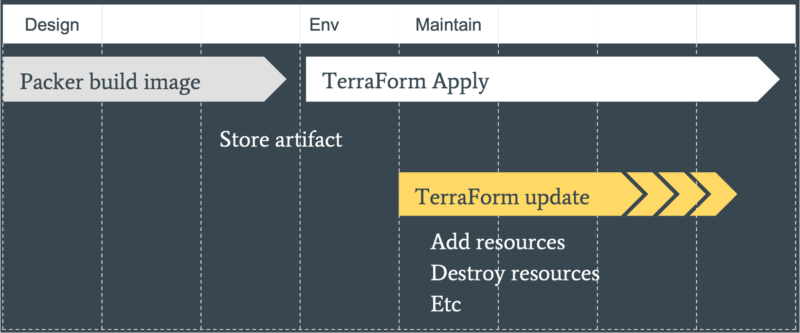

background-image: url(./assets/images/backgrounds/HashiCorp-Content-bkg.png)

## Agenda

- Why use Terraform ?
- Why use Packer ?
- Building Image with Packer
- Terraform & Packer Integration
- Packer and Terraform Workflow

???

---
background-image: url(./assets/images/backgrounds/HashiCorp-Content-bkg.png)

## Why Use Terraform ?

- Multi-cloud support
- Compliance and Security
- Disaster Recovery
- Reusability
- Terraform Plan - Key Feature
- Third-party Integration

???

Multi-cloud support – Enterprise customers want to be on multi-cloud, so aws, azure, OCI, etc


Compliance and Security – Sentinel (policy-as-code) for enterprises, Terraform compliance for open source and free versions.


Disaster Recovery – Run triggers feature for building pipeline in terraform cloud so in case of disaster, a new infrastructure can be built automatically using terraform.


Reusability – Use of Terraform Modules, variables so that application components can be re-used in different environments, applications


Terraform Plan – for knowing what would be implemented before actually implementing infrastructure


Third-party integrations – Checkov, Infracost, blast radius, aws2tf, and many more.

---
background-image: url(./assets/images/backgrounds/HashiCorp-Content-bkg.png)

## Why Use Packer ?

- Standardization and Consistency
- Automated Image Building and Deployment
- Reduced Risks of Errors
- Multi-Provider Portability
- Improved Stability
- Great Testability

???

Standardization and Consistency -- Packer can help you standardize your machine images by ensuring that each image is built with the same configuration and software stack.


Automated Image Building and deployment -- Packer enables you to define machine image creation as code, which means you can automate the entire process from start to finish


Reduced Risk of Errors – Automation reduces the risk of manual errors


Multi-provider portability – can create images of multiple platforms, including virtual machines, containers, and bare metal servers.


Improved Stability – Packer installs and configures all the software for a machine at the time the image is built. If there are bugs in these scripts, they'll be caught early, rather than several minutes after a machine is launched.


Great Testability -- machine image can be quickly launched and smoke tested to verify

---

background-image: url(./assets/images/backgrounds/HashiCorp-Content-bkg.png)

.left-column-50[
## Building Image with Packer

- Choose a base image
- Define a Packer template in JSON or HCL format
- Configure builders
- Add provisioners
- Define post-processors
- Validate the Packer template
- Build the image
- Test the image
- Deploy the image
]

.right-column-50[
``` json
        {
        "builders": [],
        "description": "A packer example template",
        "min_packer_version": "0.8.0",
        "provisioners": [],
        "post-processors": [],
        "variables": []
        }
```
]

???

Choose a base image -- The base image can be an official image from a public or private repository or a custom image that you have created.


Define a Packer template in JSON or HCL format -- The template specifies the configuration for building the image, including the source image, provisioning scripts, and post-processing steps.


Configure builders -- For example, you might specify the type of virtual machine, the size of the disk, and the network settings.


Add provisioners – Provisioners can include shell scripts, PowerShell scripts, Ansible, Chef, or other configuration management tools.


Define post-processors – For performing any final operations on the image, such as compressing, converting to a different format, or uploading to a repository.


Validate the Packer template – Run the “packer validate” command to validate the Packer template syntax and check for any errors.


Build the image – Run the “packer build” command to build the image. Packer will start a new virtual machine instance based on the source image, apply the provisioning scripts, and create a new image.


Test the Image – Launch an instance of the new image in a testing environment and validate that it meets your requirements.


Deploy the image -- Deploy the image to your production environment or store it in a repository for future use.

---
background-image: url(./assets/images/backgrounds/HashiCorp-Content-bkg.png)

## Terraform & Packer Integration

.two-column-left[
```yaml
provider "aws" {
  
  region = "us-west-2"
}

#Define the Packer template file
data "template_file" "packer_template" {
  template = file("${path.module}/web-server.packer.json")

  vars = {
    source_ami = "ami-0c55b159cbfafe1f0" # Replace with the ID of the AMI to use as the base image
  }
}

#Build a new AMI using Packer
resource "null_resource" "build_ami" {
  triggers = {
    packer_template = data.template_file.packer_template.rendered
  }

  provisioner "local-exec" {
    command = "packer build ${path.module}/web-server.packer.json"
  }
}
```
]

.two-column-right[
```yaml
# Deploy the new AMI using Terraform
resource "aws_instance" "web" {
  ami           = "${lookup(var.amis, var.region)}"
  instance_type = "t2.micro"

  tags = {
    Name = "web-server"
  }
}

# Define the AMIs to use for each region
variable "amis" {
  type = map(string)
  default = {
    us-west-2 = "${null_resource.build_ami.*.triggers.packer_template["source_ami"]}"
    us-east-1 = "ami-052c08d70def0ac62"
    eu-west-1 = "ami-0d729a60c3f8c66a3"
  }
}
```
]


???

The First block creates the image using packer.
- template in Json file
- null resource
- local exec provisioner

The second code block uses that particular image for spinning up ec2 instance using Terraform
- ec2 instance
- Map

---
background-image: url(./assets/images/backgrounds/HashiCorp-Content-bkg.png)


##Packer and Terraform Workflow



???

Design phase – Packer is used to build image from the source image.

Artifact phase – store this image

Env, Maintain phase – get into the Env and use the image in terraform to create, update ec2, etc using terraform apply
